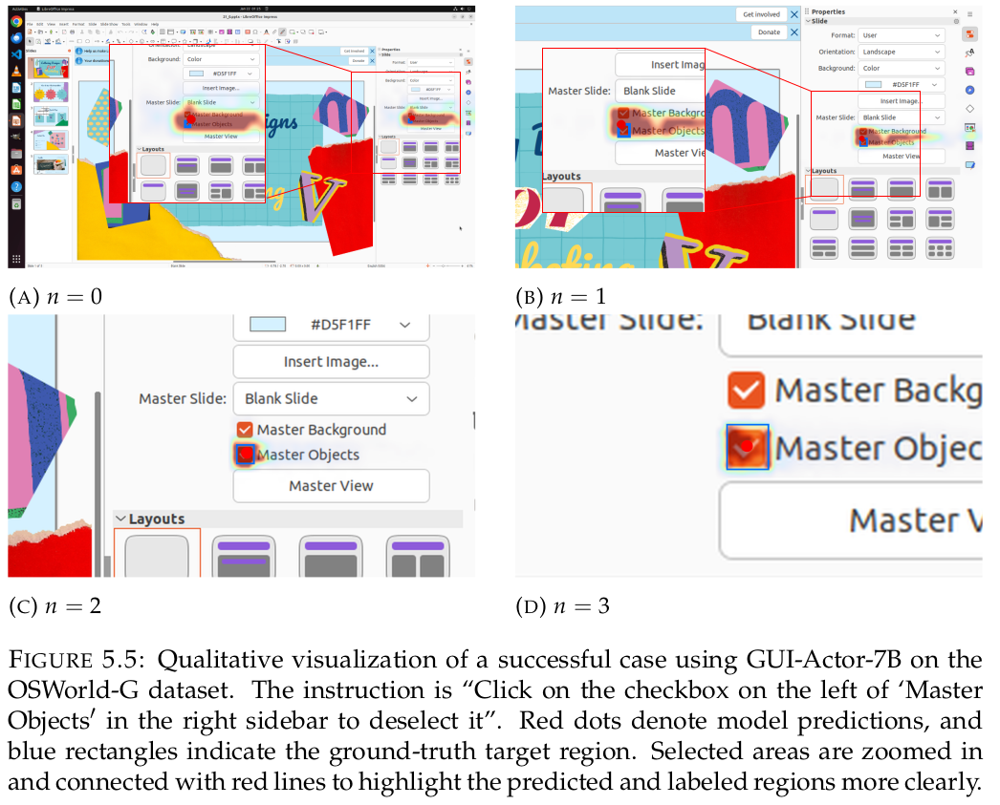
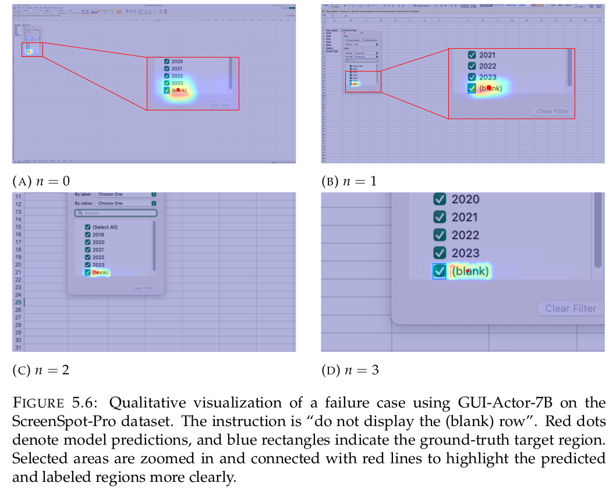

# DART: Density-Aware Adaptive Refinement Technique for GUI Grounding

> **Note:** This is a first-author research project from the **Vision Language Intelligence Lab**. Source code is not publicly available due to confidentiality restrictions.

## Highlights

- **Training-free refinement** — improves GUI grounding accuracy at inference time with no additional training or architectural changes
- **+16.7% accuracy gain** on ScreenSpot-Pro with GUI-Actor-7B — the largest single improvement
- **80.9% accuracy** on ScreenSpot-Pro with KV-Ground-8B + DART
- **5 models supported** — KV-Ground, Qwen3-VL, UI-Venus, V2P, GUI-Actor
- **3 benchmark datasets** — ScreenSpot-Pro, UI-Vision, OSWorld-G
- Outperforms existing refinement baselines (RegionFocus, MVP) across all models

---

## Demo





---

## Results

### ScreenSpot-Pro — 1,581 samples

| Model | Baseline | + DART | Gain |
|---|---|---|---|
| GUI-Actor-7B | 43.83% | **60.47%** | **+16.64%** |
| V2P-7B | 49.53% | **64.20%** | +14.67% |
| Qwen3-VL-8B | 54.59% | **68.44%** | +13.85% |
| UI-Venus-1.5-8B | 66.79% | **74.57%** | +7.78% |
| KV-Ground-8B | 72.99% | **80.90%** | +7.91% |

### UI-Vision — 5,479 samples

| Model | Baseline | + DART | Gain |
|---|---|---|---|
| GUI-Actor-7B | 21.59% | **30.99%** | **+9.40%** |
| V2P-7B | 23.93% | **33.86%** | +9.93% |
| Qwen3-VL-8B | 26.81% | **36.12%** | +9.31% |
| UI-Venus-1.5-8B | 45.36% | **53.29%** | +7.93% |
| KV-Ground-8B | 39.92% | **48.46%** | +8.54% |

### OSWorld-G — 564 samples

| Model | Baseline | + DART | Gain |
|---|---|---|---|
| GUI-Actor-7B | 48.40% | **61.35%** | **+12.95%** |
| V2P-7B | 51.95% | **62.77%** | +10.82% |
| Qwen3-VL-8B | 68.79% | **72.69%** | +3.90% |
| UI-Venus-1.5-8B | 74.29% | **75.89%** | +1.60% |
| KV-Ground-8B | 70.21% | **74.29%** | +4.08% |

### Comparison with Baseline Methods — ScreenSpot-Pro

| Method | KV-Ground-8B | Qwen3-VL-8B | UI-Venus-1.5-8B |
|---|---|---|---|
| Baseline (no refinement) | 72.99% | 54.59% | 66.79% |
| RegionFocus | 73.5% | 66.2% | 67.7% |
| MVP (k=3) | 78.43% | 65.28% | 72.17% |
| **DART** | **80.90%** | **68.44%** | **74.57%** |

DART consistently outperforms existing refinement methods across all three model families.

---

## Supported Models

| Model Type | HuggingFace Path |
|---|---|
| `kv_ground` | `vocaela/KV-Ground-8B-BaseGuiOwl1.5-0315` |
| `ui_venus` | `inclusionAI/UI-Venus-1.5-8B` |
| `qwen3vl` | `Qwen/Qwen3-VL-8B-Instruct` |

Also evaluated with GUI-Actor-7B and V2P-7B (see V2P directory for reproduction scripts).

## Supported Datasets

| Dataset | Samples | Description |
|---|---|---|
| ScreenSpot-Pro | 1,581 | Dense, high-resolution GUI interfaces |
| UI-Vision | 5,479 | Element grounding — basic / functional / spatial splits |
| OSWorld-G | 564 | GUI grounding in open-world settings (with refusal prediction) |

---

## Quick Start

```bash
# Install
pip install -r requirements.txt
pip install flash-attn --no-build-isolation

# Run evaluation (KV-Ground on ScreenSpot-Pro)
python evaluate_multi_threading_all_osworldg.py \
    --dataset screenspot_pro \
    --data_root /path/to/data \
    --model_type kv_ground \
    --model_path vocaela/KV-Ground-8B-BaseGuiOwl1.5-0315 \
    --max_iterations 6 \
    --output_dir exps1

# Multi-GPU
export CUDA_VISIBLE_DEVICES=0,1,2,3
bash run_all.sh
```

For OSWorld-G with refusal prediction, add `--refusal`.

---

## Project Structure

```text
.
├── evaluate_multi_threading_all.py            # Multi-GPU evaluation (no refusal)
├── evaluate_multi_threading_all_osworldg.py   # Multi-GPU evaluation with refusal support
├── mvp_kv_ground.py      # KV-Ground inference
├── mvp_ui_venus.py       # UI-Venus inference
├── mvp_qwen3vl.py        # Qwen3-VL inference
├── qwen3_vl/             # Modified Qwen3-VL (exposes attention maps)
├── run_all.sh            # Primary run script
├── run_all2.sh           # UI-Venus & Qwen3-VL run script
├── exps1/                # Result files (JSONL), organized by model & dataset
├── V2P/                  # V2P & GUI-Actor evaluation scripts and results
├── MVP/                  # MVP baseline scripts and results
├── regionfocus/          # RegionFocus baseline scripts
├── compute_group_accuracy.py  # Per-group accuracy computation
├── eval_all.py           # Batch evaluation across all results
├── test.ipynb            # Interactive performance analysis
└── requirements.txt
```

---

## Acknowledgments

We thank the authors of **V2P**, **GUI-Actor**, **RegionFocus**, and **MVP** for releasing their models, code, and resources.

[V2P](https://github.com/inclusionAI/AWorld-RL/tree/main/V2P) | [GUI-Actor](https://github.com/microsoft/GUI-Actor) | [RegionFocus](https://github.com/tiangeluo/regionfocus) | [MVP](https://github.com/ZJUSCL/MVP)
